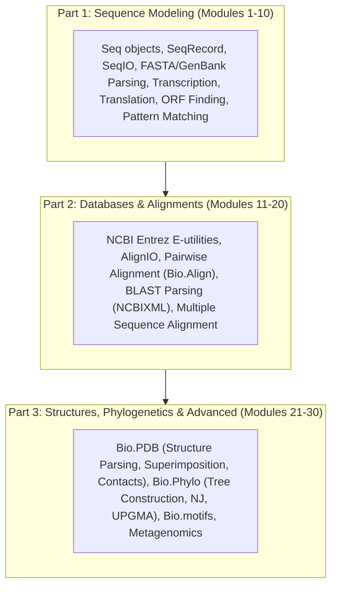

# Source Summary: 30-Module Biopython Curriculum

- **Path**: `courses/biopython/` (Modules 1 through 30)
- **Scope**: A comprehensive, step-by-step practical curriculum implementing computational biology pipelines with Python & Biopython.

## Curriculum Architecture & Module Mapping

### 1. Sequence Modeling & File Formats (Modules 1–10)
- **`Bio.Seq` & `Bio.SeqRecord`**: Biological string manipulation, IUPAC ambiguity alphabets, reverse complements, transcription ($T \to U$), standard & non-standard translation tables.
- **`Bio.SeqIO`**: High-throughput parsing and conversion across FASTA, GenBank, EMBL, FASTQ, and ABI formats.
- **Sequence Analysis**: Dinucleotide/trinucleotide frequencies, sliding-window GC content, open reading frame (ORF) extraction, and restriction enzyme digestion.

### 2. Biological Databases & Sequence Alignment (Modules 11–20)
- **`Bio.Entrez`**: Programmatic access to NCBI databases (`esearch`, `efetch`, `elink`, `esummary`, `egquery`, `espell`) for automated PubMed literature and GenBank accession querying.
- **`Bio.Align` & `Bio.AlignIO`**: Pairwise sequence alignment (Needleman-Wunsch global alignment, Smith-Waterman local alignment), substitution matrices (BLOSUM62, PAM250), and multiple sequence alignment (MSA) formats (ClustalW, PHYLIP, Stockholm, FASTA alignment).
- **`Bio.Blast`**: Automated NCBI BLAST submission via `NCBIWWW.qblast` and local XML output parsing (`NCBIXML`).

### 3. Structural Biology, Phylogenetics & Advanced Analysis (Modules 21–30)
- **`Bio.PDB`**: Parsing coordinate hierarchies (`Structure -> Model -> Chain -> Residue -> Atom`), spatial Euclidean distance matrix computation, structure superposition (`Superimposer`), dihedral angle extraction ($\phi, \psi$), and B-factor profiling.
- **`Bio.Phylo`**: Phylogenetic tree I/O (Newick, Nexus, phyloXML), distance matrix calculation, Neighbor-Joining (NJ), UPGMA, and tree branch visualization.
- **`Bio.motifs`**: Transcription factor binding motif discovery, Position Frequency Matrices (PFMs), Position Weight Matrices (PWMs), and sequence logos.
- **Metagenomics & Machine Learning**: K-mer counting and feature vectorization for taxonomic classification.

## Cross-Linked Entities & Concepts
- **Entities**: [[Biopython]], [[Bio-SeqIO]], [[Bio-PDB]], [[Bio-Entrez]], [[Bio-Phylo]], [[Bio-AlignIO]]
- **Concepts**: [[Multiple-Sequence-Alignment]], [[Phylogenetic-Tree-Reconstruction]], [[Sequence-Motif-Discovery]], [[GC-Skew]], [[Hamming-Distance-Genomics]]
