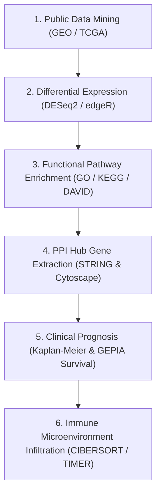

# Source Summary: Strategic Roadmap for Integrated Bioinformatics

- **Source File**: `career/Advice_for_Bioinformatics_AZE/Strategic_Career_Roadmap_for_Bioinformatics.txt`
- **Scope**: Step-by-step gold standard methodology for end-to-end dry-lab computational oncogenomics research and publication-grade pipelines.

## 6-Step Integrated Oncology Methodology

1. **Data Mining**: Sourcing clinical cohort RNA-seq count matrices from GEO/TCGA.
2. **Differential Expression**: Computing $\log_2\text{FC}$ and $p_{\text{adj}} < 0.05$ cutoff with Volcano/Heatmap plots.
3. **Pathway Enrichment**: Biological process and KEGG pathway mapping.
4. **Protein-Protein Interaction (PPI)**: Interacting network modeling in STRING and top hub gene identification via degree/closeness centrality in Cytoscape.
5. **Survival Validation**: Assessing prognostic impact of hub candidates on overall patient survival curves ($p < 0.05$).
6. **Immune Infiltration**: Deconvoluting tumor-infiltrating immune cells (macrophages, CD8+ T cells).

## Cross-Linked Entities & Concepts
- **Entities**: [[GEO-TCGA]], [[STRING-Database]], [[Cytoscape]], [[DESeq2]]
- **Concepts**: [[Protein-Protein-Interaction-Networks]], [[Kaplan-Meier-Survival-Analysis]], [[Tumor-Immune-Infiltration]]
- **Syntheses**: [[End-to-End-Integrated-Oncogenomics-Framework]]
