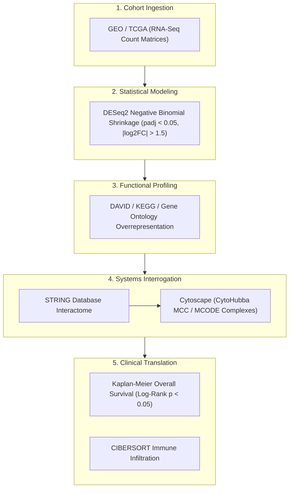

# Synthesis: End-to-End Integrated In Silico Oncogenomics Pipeline

Secondary multi-omics analysis transforms publicly archived patient datasets into novel prognostic biomarkers, therapeutic targets, and immunological insights without requiring physical wet-lab experimentation.

## Step-by-Step Rigor Criteria

1. **Cohort Preprocessing & Normalization**:
   - Filter low-count transcripts ($\text{rowSums} \ge 10$) across clinical replicates to eliminate Poisson noise artifacts.
   - Employ [[Differential-Gene-Expression-DESeq2]] dispersion shrinkage to mitigate false discovery rates on small sample sizes ($n < 20$).
2. **Topological Interactome Pruning**:
   - Rather than treating all differentially expressed genes (DEGs) equally, map DEGs onto physical protein-protein interaction networks ([[STRING-Database]]).
   - Apply Maximal Clique Centrality (MCC) in [[Cytoscape]] to isolate the **top 10 bottleneck hub regulators** driving cell cycle deregulation or oncogenic signaling.
3. **Clinical Survival & Microenvironment Prognosis**:
   - Validate that elevated hub gene expression directly stratifies patient mortality in [[Kaplan-Meier-Survival-Analysis]].
   - Dissect tumor microenvironment immune composition using [[Tumor-Immune-Infiltration]] (e.g. CIBERSORTx) to evaluate tumor immunogenicity and potential immunotherapy sensitivity.

## Related Entities & Concepts
- [[GEO-TCGA]]
- [[DESeq2]]
- [[STRING-Database]]
- [[Cytoscape]]
- [[Protein-Protein-Interaction-Networks]]
- [[Kaplan-Meier-Survival-Analysis]]
- [[Tumor-Immune-Infiltration]]
- [[TP53]]
