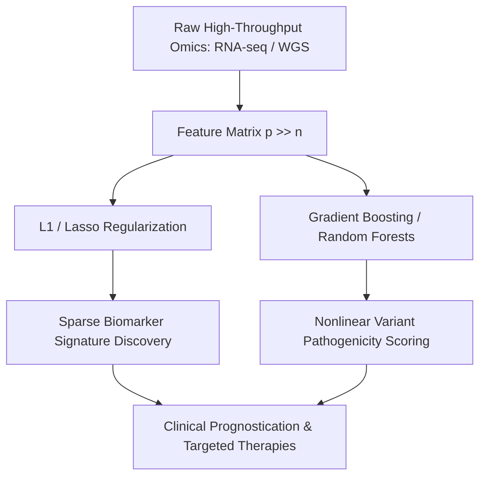

# Synthesis: High-Dimensional Statistical Learning in Multi-Omics and Variant Pathogenicity

Computational genomics presents extreme dimensional disparity ($p \gg n$), with tens of thousands of transcripts or millions of genomic variants measured across small patient cohorts. Formulating sound machine learning solutions requires integrating rigorous statistical regularization with biological domain priors.

## Core Methodological Intersections

1. **Exact Feature Selection vs. Dense Regularization**:
   - Genomic expression matrices feature high multi-collinearity. As demonstrated in [[L1-vs-L2-High-Dimensional-Genomics]], $L_1$ Lasso shrinkage is strictly superior to $L_2$ Ridge when identifying sparse causal gene subsets ($s \ll p$).
2. **Controlling Variance with Ensemble Learning**:
   - High variance from deep decision trees is mitigated through bootstrap aggregation ([[Cambridge-ML-Math]]), while residual bias is eliminated using gradient boosting architectures ([[Boosting-Theory-AdaBoost]]) to predict non-coding variant functional impact.
3. **From Mutations to Pathogenicity**:
   - Simple sequence Hamming distance ([[Hamming-Distance-Genomics]]) flags divergence, while high-dimensional ML models evaluate the functional consequence based on conservation, chromatin accessibility, and protein structural metrics ([[Structural-Biophysics-vs-AI-Folding]]).

## Related Entities & Concepts
- [[Cambridge-ML-Math]]
- [[L1-vs-L2-High-Dimensional-Genomics]]
- [[Boosting-Theory-AdaBoost]]
- [[Bias-Variance-Tradeoff]]
- [[Genomic-Analyzer]]
