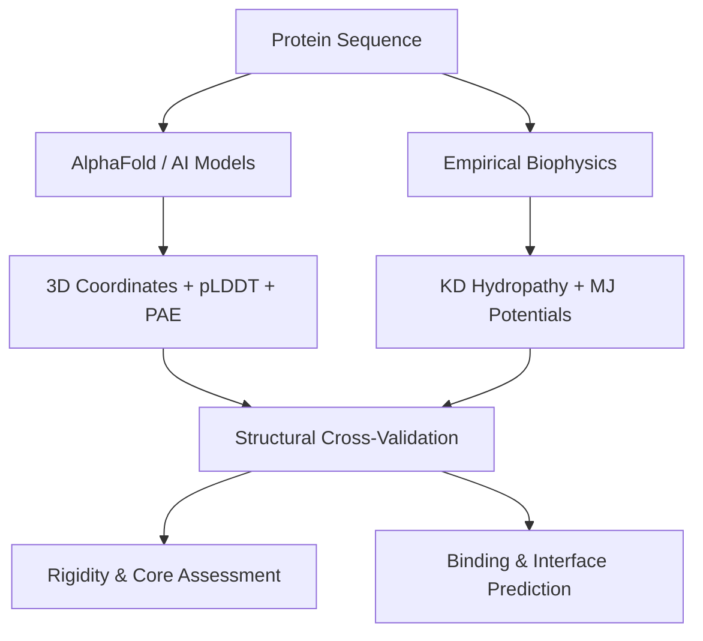

# Synthesis: Empirical Structural Biophysics vs. AI-Driven Protein Structure Prediction

As computational structural biology transitions from statistical mechanics approximations to deep learning representations, empirical biophysical metrics continue to serve as essential orthogonal validation criteria.

## Comparative Framework

| Metric / Method | Domain / Scale | Physical Interpretation | Implementation / Tool |
|---|---|---|---|
| **Kyte-Doolittle Hydropathy** | 1D sequence window | Residue water-transfer free energy | [[Kyte-Doolittle-Hydropathy]], [[Protein-Computational-Analysis]] |
| **Miyazawa-Jernigan Potentials** | 3D non-covalent contacts | Residue-residue statistical contact free energy ($E$) | [[Miyazawa-Jernigan-Potentials]], [[Protein-Computational-Analysis]] |
| **Isotropic B-Factor** | 3D crystallographic atoms | Atomic thermal vibration and mean-square displacement ($\langle u^2 \rangle$) | [[B-Factor-Thermal-Displacement]] |
| **AlphaFold pLDDT** | 3D per-residue confidence | Predicted local distance difference test ($0\text{--}100$) | [[AlphaFold-DB]] |
| **AlphaFold PAE** | 3D inter-residue matrix | Expected positional error ($\text{\AA}$) of residue $x$ aligned on residue $y$ | [[AlphaFold-DB]] |

## Key Insights

1. **Rigidity and Confidence Alignment**: In high-resolution crystal structures (e.g. [[Insulin-1COH]]), packed hydrophobic core residues exhibit strong negative correlation between packing density and B-factors. In AlphaFold predictions, these same packed hydrophobic residues receive high pLDDT ($>90$), confirming agreement between empirical packing physics and deep learning confidence.
2. **Disorder and Solvent Exposure**: Regions characterized by low Kyte-Doolittle hydropathy, high [[Solvent-Accessible-Surface-Area|SASA]], and elevated B-factors correspond directly to low pLDDT ($<50$) intrinsically disordered regions (IDRs) or flexible inter-domain linkers.
3. **Decoy Ranking**: While deep neural networks output single or ensemble folded models, statistical contact potentials ([[Miyazawa-Jernigan-Potentials]]) provide independent energetic sanity checks to screen for steric clash or non-physical hydrophobic exposure.

## Related Entities & Concepts
- [[Protein-Computational-Analysis]]
- [[Protein-3D-Metrics]]
- [[AlphaFold-DB]]
- [[Insulin-1COH]]
